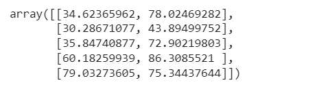
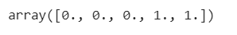
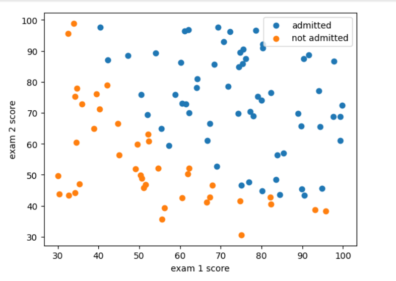
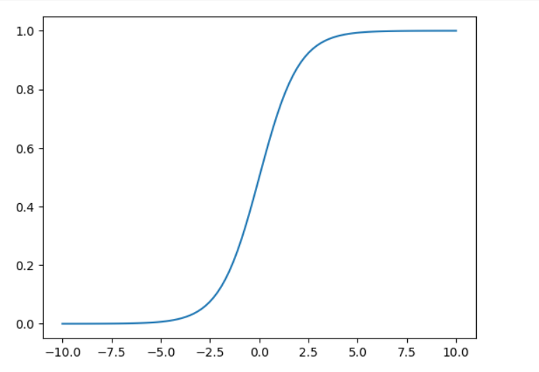
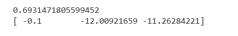
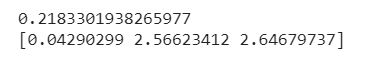
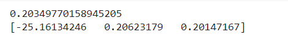
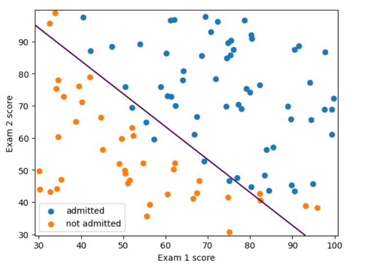
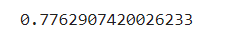
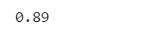

# Implementation-of-Logistic-Regression-Using-Gradient-Descent

## AIM:
To write a program to implement the the Logistic Regression Using Gradient Descent.

## Equipments Required:
1. Hardware – PCs
2. Anaconda – Python 3.7 Installation / Jupyter notebook

## Algorithm
1. Import the libraries and Load the dataset.
2. Define X and Y array and Define a function for costFunction,cost and gradient.
3. Define a function to plot the decision boundary.
4. Define a function to predict the Regression value.

## Program:
```
/*
Program to implement the the Logistic Regression Using Gradient Descent.
Developed by: Soundariyan M N
RegisterNumber:  212222230146
*/
```
```python
import pandas as pd
import matplotlib.pyplot as plt
import numpy as np
from scipy import optimize

data = np.loadtxt('ex2data1.txt',delimiter = ',')
x = data[:,[0,1]]
y = data[:,2]

x[:5]

y[:5]

plt.figure()
plt.scatter(x[y ==1][:,0],x[y==1][:,1], label = "admitted")
plt.scatter(x[y ==0][:,0],x[y==0][:,1], label = "not admitted")
plt.xlabel("exam 1 score")
plt.ylabel("exam 2 score")
plt.legend()
plt.show()

def sigmoid(z):
  return 1 / (1+ np.exp(-z))

plt.plot()
x_plot = np.linspace(-10, 10, 100)
plt.plot(x_plot, sigmoid(x_plot))
plt.show()

def costFuction(theta, x,y):
  h=sigmoid(np.dot(x,theta))
  j=-(np.dot(y,np.log(h))+np.dot(1-y,np.log(1-h)))/x.shape[0]
  grad=np.dot(x.T,h-y)/x.shape[0]
  return j,grad

X_train=np.hstack((np.ones((x.shape[0],1)),x))
theta=np.array([0,0,0])
j,grad=costFuction(theta,X_train,y)
print(j)
print(grad)

X_train=np.hstack((np.ones((x.shape[0],1)),x))
theta=np.array([-24, 0.2, 0.2])
j,grad=costFuction(theta,X_train,y)
print(j)
print(grad)

def cost(theta,x,y):
  h=sigmoid(np.dot(x,theta))
  j=-(np.dot(y,np.log(h))+np.dot(1-y,np.log(1-h)))/x.shape[0]
  return j

def gradient(theta,x,y):
  h=sigmoid(np.dot(x,theta))
  grad = np.dot(x.T,h-y)/x.shape[0]
  return grad

x_train=np.hstack((np.ones((x.shape[0],1)),x))
theta=np.array([0,0,0])
res = optimize.minimize(fun=cost,x0=theta,args=(x_train,y),method='Newton-CG',jac=gradient)
print(res.fun)
print(res.x)

def plotDecisionBoundary(theta, x, y):
  x_min, x_max = x[:,0].min() - 1, x[:,0].max() + 1
  y_min, y_max = x[:,1].min() - 1, x[:,1].max() + 1
  xx, yy = np.meshgrid(np.arange(x_min, x_max, 0.1),np.arange(y_min, y_max, 0.1))
  x_plot = np.c_[xx.ravel(), yy.ravel()]
  x_plot = np.hstack((np.ones((x_plot.shape[0],1)),x_plot))
  y_plot = np.dot(x_plot, theta).reshape(xx.shape)

  plt.figure()
  plt.scatter(x[y==1][:,0], x[y==1][:,1], label= "admitted")
  plt.scatter(x[y==0][:,0], x[y==0][:,1], label= "not admitted")
  plt.contour(xx, yy, y_plot, levels=[0])
  plt.xlabel("Exam 1 score")
  plt.ylabel("Exam 2 score")
  plt.legend()
  plt.show()

plotDecisionBoundary(res.x,x,y)

prob = sigmoid(np.dot(np.array([1,45,85]),res.x))
print(prob)

def predict(theta, x):
  x_train = np.hstack((np.ones((x.shape[0],1)),x))
  prob = sigmoid(np.dot(x_train, theta))
  return (prob >= 0.5).astype(int)

np.mean(predict(res.x, x)==y)
```
## Output:
## Array value of x


## Array value of y


## Score graph


## Sigmoid function graph


## x train gradient value


## y train gradient value


## Regression value


## Decision boundary graph


## Probability value


## Prediction value of graph


## Result:
Thus the program to implement the the Logistic Regression Using Gradient Descent is written and verified using python programming.

